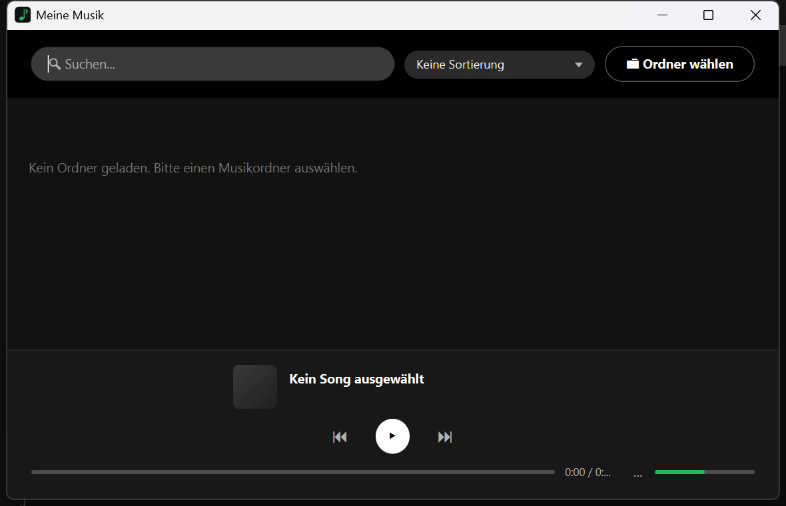

<div align="center">

# 🎵 Meine Musik

**A lightweight, Spotify-inspired desktop music player for your local `.wav` library — built with JavaFX.**


</div>

<p align="center">
  
</p>

## Overview

**Meine Musik** is a small desktop music player that scans a folder tree for `.wav` files, reads their
ID3 metadata (title, artist, cover art) and shows them in a Spotify-style dark card grid. Rate tracks
with a 5-star system, sort by rating, search live, and skip tracks by swiping the now-playing preview.

No account, no cloud, no telemetry — just a folder full of `.wav` files and a UI that doesn't get in the way.

## ✨ Features

| | |
|---|---|
| 📂 **Recursive folder scan** | Pick any folder — all `.wav` files in it and its subfolders are found automatically. Duplicate filenames are only listed once. |
| 🏷️ **ID3 metadata** | Title, artist, album and embedded cover art are read via jaudiotagger. Falls back to the filename and a music-note placeholder when tags/art are missing. |
| 🃏 **Card grid UI** | Spotify-inspired dark theme — tracks are shown as cards (cover, title, artist, stars, duration) instead of a plain table. |
| ⭐ **5-star ratings** | Click a star to rate a track (click the same star again to clear it). Ratings persist across restarts. |
| 🔃 **Sort by rating** | Order the grid by rating (ascending/descending) via the dropdown in the top bar. |
| 🔍 **Live search** | Filter the grid instantly by title, artist or album as you type. |
| ▶️ **Playback controls** | Play/pause, previous/next, a seekable progress bar and a volume slider — both rendered as filled, Spotify-style bars. |
| 👉 **Swipe to skip** | Click-and-drag the now-playing preview left/right to jump to the next/previous track. |
| 💾 **Persistent ratings** | Ratings are stored as JSON in `%APPDATA%\MusicPlayer\ratings.json`, keyed by absolute file path — survives rescans and app restarts. |
| 🖼️ **Custom app icon** | A generated green eighth-note icon, used for the window/taskbar icon and the packaged `.exe`. |
| 📦 **Standalone `.exe`** | Packaged via `jpackage` into a native Windows app image — bundles its own Java runtime, no separate JRE/JDK install needed to run it. |

## 🖥️ Tech stack

- **Java 21** (developed & tested against JDK 26)
- **JavaFX 21.0.4** — `javafx-controls`, `javafx-media`
- **jaudiotagger 3.0.1** — ID3 tag & artwork extraction
- **[org.json](https://github.com/stleary/JSON-java) 20240303** — rating persistence
- **Maven** — build, with `maven-shade-plugin` for a self-contained runnable jar
- **`jpackage`** (bundled with the JDK) — native Windows app image / `.exe`

## 📁 Project structure

```
music-player/
├── pom.xml
├── packaging/
│   ├── make-icon.ps1        # generates the app icon (PNG + multi-size .ico)
│   └── app-icon.ico
├── docs/
│   └── screenshot.png
└── src/main/
    ├── java/com/musicplayer/
    │   ├── Main.java               # Application entry point (Scene/Stage setup)
    │   ├── Launcher.java           # Plain entry point, see note below
    │   ├── controller/
    │   │   └── MainController.java # builds the whole UI, wires up events
    │   ├── model/
    │   │   └── Song.java           # song metadata + observable rating
    │   └── service/
    │       ├── MusicScanner.java   # recursive .wav discovery, de-duplication
    │       ├── MetadataService.java# ID3 tags + cover art (jaudiotagger)
    │       ├── AudioPlayer.java    # MediaPlayer wrapper
    │       └── RatingStore.java    # JSON rating persistence in %APPDATA%
    └── resources/
        ├── css/style.css           # Spotify-inspired dark theme
        └── icon/app-icon.png       # window/taskbar icon
```

## 🚀 Getting started

### Prerequisites

- **JDK 21+** (JavaFX modules are pulled in automatically via Maven — no separate SDK download needed)
- **Maven** (or open the folder directly in IntelliJ IDEA, which bundles its own Maven)

### Clone & run

```bash
git clone <repository-url>
cd music-player
mvn javafx:run
```

### Running from an IDE

> **Important:** run the **`Launcher`** class, not `Main`.
>
> `Main` extends `javafx.application.Application`. Launching it directly via a plain classpath command
> (which is what IntelliJ's auto-generated run configuration does) triggers:
> `Error: JavaFX runtime components are missing, and are required to run this application`
> even though the JavaFX jars are present. `Launcher` is a tiny indirection (`public static void main` that
> just calls `Main.main(args)`) that sidesteps this well-known JavaFX/IDE quirk.

## 📦 Building a standalone `.exe`

The app is packaged as a native Windows app image using `jpackage`, so end users don't need Java installed.

**1. Build a self-contained runnable jar:**

```bash
mvn clean package
```

This produces `target/music-player-1.0-SNAPSHOT-app.jar` — a shaded jar containing the app, JavaFX
runtime classes and all dependencies.

**2. Package it with `jpackage`:**

```bash
mkdir -p packaging/app-input
cp target/music-player-1.0-SNAPSHOT-app.jar packaging/app-input/music-player-app.jar

jpackage \
  --type app-image \
  --input packaging/app-input \
  --main-jar music-player-app.jar \
  --main-class com.musicplayer.Launcher \
  --name "MusicPlayer" \
  --app-version 1.0.0 \
  --vendor "ZenoxArt" \
  --icon packaging/app-icon.ico \
  --dest packaging/dist
```

The result is `packaging/dist/MusicPlayer/MusicPlayer.exe` — a folder containing the executable and a
bundled Java runtime. Copy or zip the whole `MusicPlayer` folder to distribute it.

> **Note:** `--type app-image` produces a runnable folder + `.exe`, no installer. Building a full installer
> (`--type exe`, with Start Menu shortcut and uninstaller) additionally requires the
> [WiX Toolset v3](https://wixtoolset.org/) to be installed on the build machine.

## ⭐ Ratings storage

Ratings are stored as a flat JSON map of absolute file path → rating (`1`–`5`), e.g.:

```json
{
  "C:\\Users\\you\\Music\\Track One.wav": 5,
  "C:\\Users\\you\\Music\\Subfolder\\Track Two.wav": 3
}
```

Location: `%APPDATA%\MusicPlayer\ratings.json` (falls back to the user home directory if `%APPDATA%`
isn't set). Clicking a star that already matches a track's current rating clears it (removes the entry).

## 🗺️ Known limitations / possible next steps

- Only `.wav` files are scanned by design — easy to extend in `MusicScanner`.
- No playlists, queue reordering, or shuffle/repeat yet.
- Cover art is only shown if it's embedded in the file's ID3 tag; there's no external artwork lookup.
- Windows-only packaging instructions (the JavaFX/Maven parts are cross-platform, but `jpackage` output
  and paths like `%APPDATA%` are Windows-specific).

## 📄 License

No license has been chosen for this project yet.
